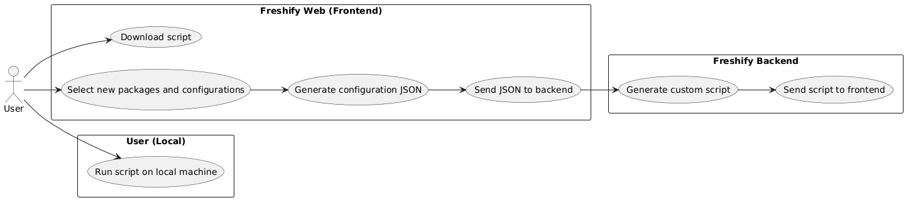
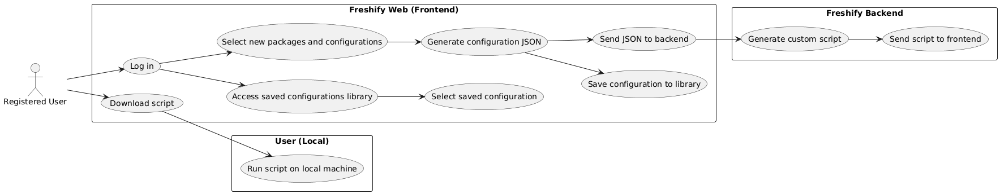
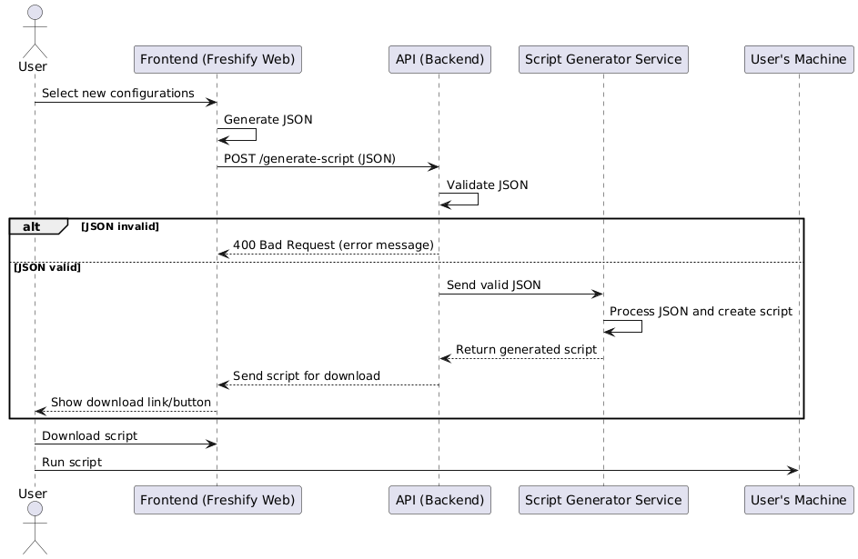

# Project Vision

I would like to shape the main idea:  
**"Freshify sets up a clean Linux environment to a fully custom setup using configuration files. Create your own configuration and run Freshify on it!"**

Along with an interactive website where users can easily choose their configurations and packages in a user-friendly way.

## Use Case Diagram (UC)

## Sequence Diagram (SD)

